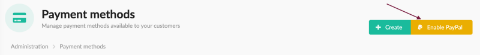
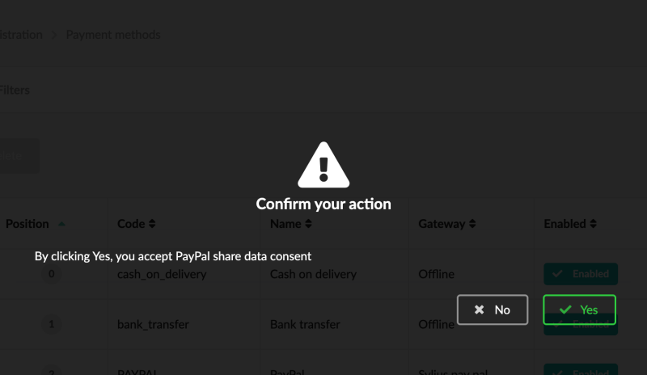
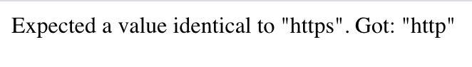
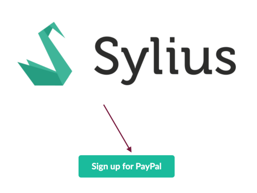
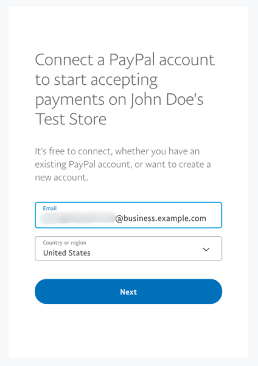
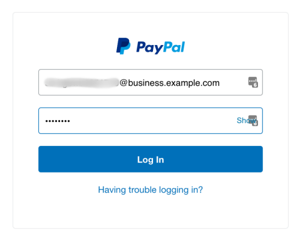
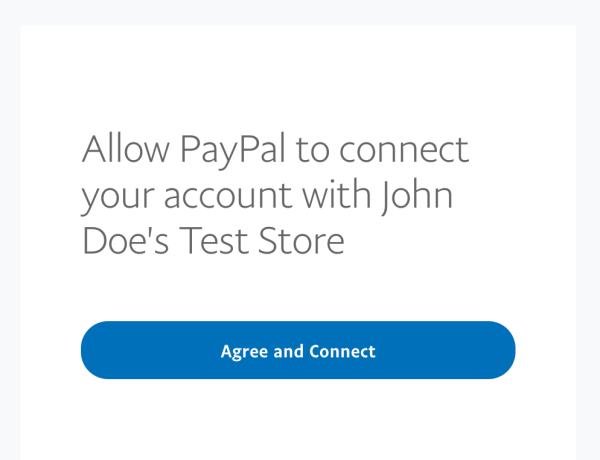
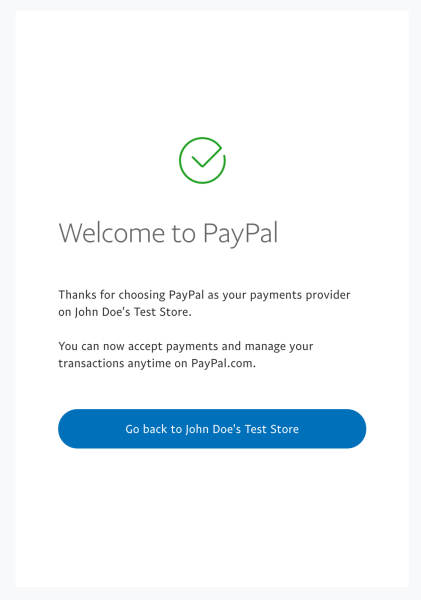
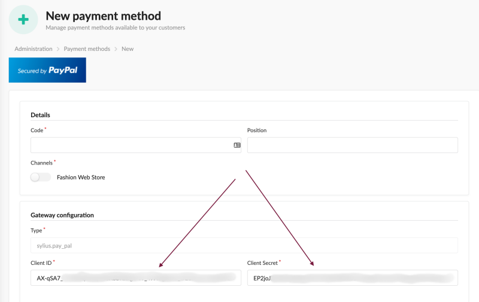

## Onboarding

To be able to use the PayPal integration as a Store Owner, you need to onboard with your PayPal business account.

#### BEWARE!

Remember, that by default plugin is using a sandbox mode - so you need to onboard with a sandbox account.
Check out [this chapter](sandbox-vs-live.md) for more information.

1. Click **Enable PayPal** on `/admin/payment-methods` or create a new payment method with _PayPal_ gateway:

    

1. Confirm that you understand, you will be asked to accept PayPal consents:

    
    
    #### BEWARE!

    If you will encounter following error:
    
    Please ensure, that your website is accessible from the internet as described in [beware section of installation docs](installation.md#beware)
    and that you are using https connection.

1. Click the _Sign up for PayPal_ button (we will try to improve the UX here [soon](https://github.com/Sylius/PayPalPlugin/issues/114)):

    
    
1. Specify which PayPal account you would use for onboarding:

    
    
1. If you use the business account you would be asked for logging in. For personal account, you would be asked to upgrade it to business:

    
    
1. Allow PayPal to connect to Sylius:

    
    
1. Go back to the store:

    
    
1. Complete the rest of the payment method form. Notice the client id and client secret provided by PayPal:

    
    
If everything is ok (consents are accepted, email is verified and webhooks were created successfully), you are able
to use a PayPal Commerce Platform integration 🎉

---

Prev: [PayPal environment](sandbox-vs-live.md)  
Next: [Reports](reports.md)
