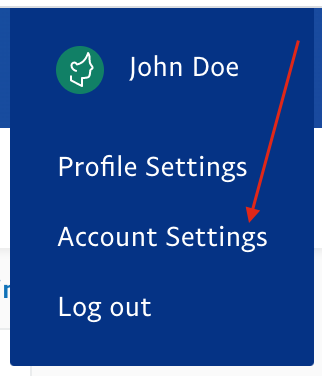
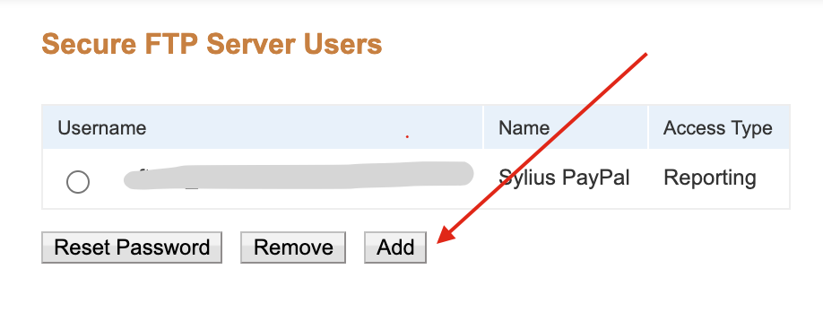

## Reports

To be able to download reports about your payouts, you need to have reports feature enabled on your PayPal account. Also,
it's required to configure SFTP account and set its data in `.env` file.

1. Log in to your PayPal account
2. Enter the profile settings

    

3. Pass to SFTP accounts panel

    

4. Create a new SFTP account

    

5. Configure username and password in payment method's configuration

---

Prev: [Onboarding](onboarding.md)  
Next: [Processing payments](processing-payments.md)
